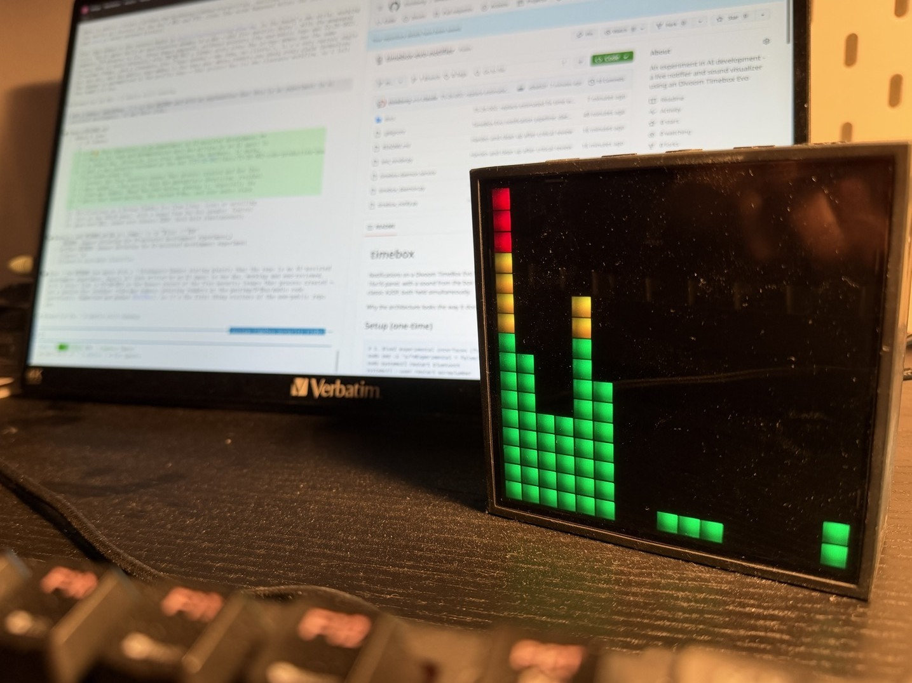

# timebox

> **⚠️ This repository is an experiment in AI-assisted development.**
> Nearly all code and documentation here was written by an AI agent in
> a single day, driven by live trial against the hardware. It works,
> and it was security-reviewed at the end ([TS-26-002](docs/TS-26-002-code-production-quality-trade-study.txt)
> records the five security issues that process created and how they
> were caught) — but use it with the appropriate skepticism: residual
> risks may remain. Read the code before running it, especially the
> parts that touch pairing, the system D-Bus, and your audio stack.

Notifications on a Divoom TimeBox Evo from Linux: icons or scrolling
text on the 16x16 panel, with a sound from the box speaker. Control
goes over BLE, sound over classic A2DP, both held simultaneously.

Why the architecture looks the way it does: [TBX-26-001](docs/TBX-26-001-notification-pipeline.txt) —
all memos in the [register](docs/REGISTER.md).



## Setup (one-time)

```bash
# 1. BlueZ experimental interfaces (for per-device bearer pinning)
sudo sed -i 's/^#Experimental = false/Experimental = true/' /etc/bluetooth/main.conf
sudo systemctl restart bluetooth
systemctl --user restart wireplumber   # wireplumber loses BlueZ on restart

# 2. Find your box's MAC (shows up as "TimeBox-Evo-light" /
#    "TimeBox-Evo-audio" while scanning) and export it:
bluetoothctl scan on
export TIMEBOX_ADDRESS=<box-mac>

# 3. Pair the box (classic bond) and trust it — trusted means its
#    audio link latches silently at every power-on
bluetoothctl pair $TIMEBOX_ADDRESS
bluetoothctl trust $TIMEBOX_ADDRESS

# If your box asks for a PIN, export it so the daemon/CLI can answer
# pairing prompts automatically (default: 0000):
export TIMEBOX_PIN=<your-pin>

# 4. Python environment
python -m venv .venv
.venv/bin/pip install bleak dbus_fast divoom_protocol
```

## Daemon (recommended)

Connects once, holds both links, serves notifications from a FIFO
with sub-second latency:

```bash
.venv/bin/python timebox_daemon.py &
```

### Install as a systemd user service

```bash
# Config (address required; PIN only if your box asks for one)
mkdir -p ~/.config/timebox
printf 'TIMEBOX_ADDRESS=<box-mac>\nTIMEBOX_PIN=<pin>\n' > ~/.config/timebox/env
chmod 600 ~/.config/timebox/env

# App + venv into ~/.local/share/timebox
mkdir -p ~/.local/share/timebox
cp timebox_daemon.py timebox_bridge.py timebox_notify.py ~/.local/share/timebox/
python -m venv ~/.local/share/timebox/.venv
~/.local/share/timebox/.venv/bin/pip install bleak dbus_fast divoom_protocol

# Unit into ~/.config/systemd/user, then enable and start
cp timebox-daemon.service ~/.config/systemd/user/
systemctl --user daemon-reload
systemctl --user enable --now timebox-daemon

# Logs / status
journalctl --user -u timebox-daemon -f
systemctl --user status timebox-daemon
```

The units run the copy in `~/.local/share/timebox` — adjust
`WorkingDirectory`/`ExecStart` in the `.service` files if you install
elsewhere. The daemon restarts automatically (15 s backoff) if the
box is unreachable.

Then notifications are one shell line — JSON per line into the FIFO:

```bash
FIFO=$XDG_RUNTIME_DIR/timebox.fifo

# Envelope icon with unread count, default chime
echo '{"count": 3}' > $FIFO

# Scrolling text (A-Z, digits, punctuation; umlauts transliterated)
echo '{"text": "Build failed!"}' > $FIFO

# Green, faster scroll, no sound
echo '{"text": "Deploy OK", "icon_color": [0,255,80], "fps": 15, "silent": true}' > $FIFO

# Custom sound and colors
echo '{"count": 7, "icon_color": [40,200,255], "sound": "/usr/share/sounds/ocean/stereo/bell.oga"}' > $FIFO

# Live 16-band spectrum of whatever the system is playing
echo '{"visualizer": true}' > $FIFO            # endless
echo '{"visualizer": true, "seconds": 30}' > $FIFO  # fixed duration
echo '{"visualizer": true, "mode": "tunnel"}' > $FIFO  # psychedelic tunnel
echo '{"visualizer": false}' > $FIFO           # stop

# Notifications sent while the visualizer runs are drawn on top of the
# bars, over an opaque band, so they stay legible.
```

The visualizer records the default sink's *monitor* (what the speakers
play — never the microphone), which KDE reports with the mic-in-use tray
icon, labeled "TimeBox visualizer" — but only while a real microphone
device is present; with none attached KDE shows nothing at all. In
endless mode the capture — and with it the icon — pauses after 10 s of
silence and resumes when audio plays again.

All keys (each optional):

| Key            | Meaning                                    | Default            |
|----------------|--------------------------------------------|--------------------|
| `text`         | scroll this text instead of the icon       | —                  |
| `fps`          | scroll speed in frames/s (1 px per frame)  | `10`               |
| `count`        | badge number 0–99 on the envelope icon     | `1`                |
| `icon_color`   | icon / text color `[r,g,b]`                | `[255,60,40]`      |
| `number_color` | badge color `[r,g,b]`                      | `[255,255,255]`    |
| `background`   | background color `[r,g,b]`                 | `[0,0,0]`          |
| `brightness`   | panel brightness 0–100                     | unchanged          |
| `sound`        | audio file to play through the box         | message chime      |
| `silent`       | `true` = no sound                          | `false`            |
| `visualizer`   | `true` starts the live spectrum, `false` stops it | —           |
| `seconds`      | visualizer duration; omit for endless      | endless            |
| `mode`         | visualizer look: `"bars"`, or `"tunnel"` — spectrum rings flowing inward, fading with age; switchable while running | `"bars"` |

## KDE notifications on the box

`timebox_bridge.py` mirrors KDE's notification bell: allow-listed apps bump an
unread **count badge** on the panel (envelope + number). It listens on the
session bus, so KDE's own notifications keep working untouched — and only the
count is ever sent to the box, never the message text.

```bash
# Which apps reach the box (nothing is forwarded if unset).
# The name is the app's D-Bus app_name — see it with:
#   dbus-monitor --session "interface='org.freedesktop.Notifications'"
echo 'TIMEBOX_ONLY_APPS=Thunderbird,Nextcloud' >> ~/.config/timebox/env

cp timebox-bridge.service ~/.config/systemd/user/
systemctl --user daemon-reload
systemctl --user enable --now timebox-bridge
journalctl --user -u timebox-bridge -f
```

The badge counts notifications that are still unread: dismissing one (or
clicking it) decrements it, while one that merely times out on screen stays
counted — same as the bell icon. While the visualizer runs, an arriving badge
shows on top of the bars for a few seconds instead of persisting.

How it works and why it eavesdrops rather than replaces KDE's notification
daemon: [TBX-26-003](docs/TBX-26-003-kde-notification-bridge.txt).

## One-shot CLI

Same options as flags. If the daemon is running, the CLI hands the
notification to it and returns instantly; otherwise it connects
itself (~10–20 s, audio may retry for up to a few minutes):

```bash
.venv/bin/python timebox_notify.py --count 5
.venv/bin/python timebox_notify.py --text "Kaffee ist fertig!" --icon-color 255,180,0
.venv/bin/python timebox_notify.py --count 12 --silent --brightness 60
```

## Practical examples

```bash
# Long-running command, notify on completion
make -j8; echo "{\"text\": \"make: exit $?\"}" > $XDG_RUNTIME_DIR/timebox.fifo

# Cron: top of every hour, quietly
0 * * * * echo '{"text": "'"$(date +\%H:00)"'", "silent": true}' > /run/user/1000/timebox.fifo
```

## Security notes

- **The panel is a public display.** The box's BLE side is unencrypted
  and unauthenticated by design (its firmware never pairs the LE link):
  everything you display — including notification text — is readable by
  a BLE sniffer in radio range, and anyone in range can connect and draw
  on the panel. Don't send confidential content. Audio (A2DP) is
  link-encrypted via the classic bond.
- **The FIFO is your trust boundary.** It is created 0600 inside
  `$XDG_RUNTIME_DIR` (the daemon refuses to start without it); whoever
  can write it can display content, start the visualizer, and play any
  file readable by your user (`sound` key).
- The daemon registers a Bluetooth agent that auto-answers pairing and
  authorization **only for the configured box address**; requests from
  any other device are rejected.
- The daemon's journal log records notification keys, not content.
- The KDE bridge eavesdrops the session bus, so it *sees* every notification
  in-process — but it reads only the app name, forwards only a count, and logs
  neither. No notification text ever reaches the box (or the air).

## Troubleshooting

- **First notification after box power-cycle is slow (~15 s)** —
  expected; the daemon re-establishes BLE, everything after is instant.
- **No sound, `br-connection-busy`** — the box only reliably brings
  audio up itself, at power-on. Power-cycle the box; trusted, it
  latches within seconds. A stuck connect attempt clears with
  `bluetoothctl block <mac>` + `unblock`.
- **Sink missing although connected** — `systemctl --user restart
  wireplumber` (happens after bluetoothd restarts).
- **A PIN dialog appears** — the daemon answers it itself while
  running, using `$TIMEBOX_PIN` (default `0000`). Set the variable
  in the daemon's environment if your box uses a different PIN.
